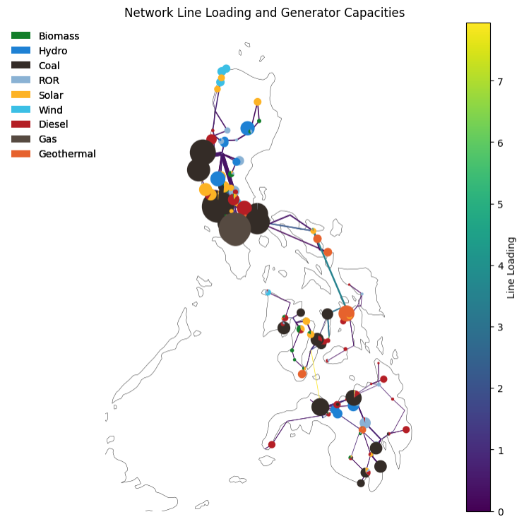

# PyPSA-PH: High-Resolution Open Source Power System Model for the Philippines

## Overview

This Jupyter Notebook provides a comprehensive, high spatial and temporal resolution model of the Philippine power grid using [PyPSA (Python for Power System Analysis)](https://pypsa.readthedocs.io/en/latest/). The model, called PyPSA-PH, is designed for research, planning, and scenario analysis to support the integration of renewable energy, grid modernization, and sustainable energy policy in the Philippines. The current model is currently composed of 192 nodes/buses, 425 generation units, 236 transmission lines, 25 storage units andd demand data benchedmarked from the year 2023.

## Features

- **Actual Trading Node Spatial Resolution:** Models the grid at the level of real trading nodes or aggregated administrative/provincial/district regions.
- **Sub-daily (Hourly or Finer) Temporal Resolution:** Captures renewable intermittency and operational dynamics.
- **Data-Driven:** Uses actual Philippine system data for network topology, generation, storage, and time series.
- **Flexible Aggregation:** Supports different spatial aggregation schemes for buses and loads.
- **Scenario Analysis:** Includes functions for projecting future scenarios (demand growth, CO₂ reduction, hydrogen sector coupling, etc.).
- **Visualization:** Provides rich plots for network topology, dispatch, generation mix, LCOE, emissions, and more.

## Workflow

1. **Data Import and Preprocessing:** Loads network, generator, storage, and time series data.
2. **Network Construction:** Builds the PyPSA network with buses, loads, generators, storage, and lines.
3. **Cost and Technology Mapping:** Integrates technology-specific costs and parameters.
4. **Temporal Resolution:** Sets up model snapshots for the desired time granularity.
5. **Optimization:** Solves the baseline and scenario models using linear optimization.
6. **Results Visualization:** Plots network, dispatch, prices, generation mix, and key metrics.
7. **Scenario Functions:** Projects the network into future years with customizable parameters.

## How to Use

- **Requirements:** Python, Jupyter Notebook, PyPSA, pandas, geopandas, matplotlib, cartopy, and other dependencies (see imports in the notebook).
- **Data:** Place required CSV and shapefile data in the `data/` directory as referenced in the notebook.
- **Running the Notebook:** Execute cells sequentially. For future scenario simulations, follow the instructions in the relevant sections.
- **Scenario Analysis:** Use provided functions to create and analyze custom or predefined future scenarios. Results can be exported and visualized.

## Structure

- **01 Import Packages**
- **02 Create Network**
    - Load network data
    - Initialize PyPSA network
- **03 Add Network Components**
    - Set time snapshots
    - Add loads, generators, storage, lines, carriers
- **04 Optimize Baseline Model**
- **05 Results and Visualization**
- **06 Future Scenario Simulations**
    - Functions for projection and analysis
    - Multi-scenario comparison tools

## Research Objectives

- Build a high-resolution baseline PyPSA model for the Philippines.
- Verify model outputs with actual generation and market data.
- Analyze grid bottlenecks, expansion needs, and policy impacts.
- Support academic and practical planning for a sustainable energy future.

## References

- [PyPSA Documentation](https://pypsa.readthedocs.io/en/latest/)
- [PyPSA Earth](https://pypsa-earth.readthedocs.io/en/latest/)
- [TU Berlin: Data Science for Energy System Modelling](https://fneum.github.io/data-science-for-esm/intro.html#jupyter.org/)
- [GitHub PyPSA Sources](https://github.com/PyPSA)

## Contact

*Arizeo C. Salac*  
DESTEC, University of Pisa  
arizeo.salac@phd.unipi.it

---

Documentation of input data to follow on next update.
*For detailed workflow, code, and scenario instructions, see the notebook cells and markdown documentation within this file.*
